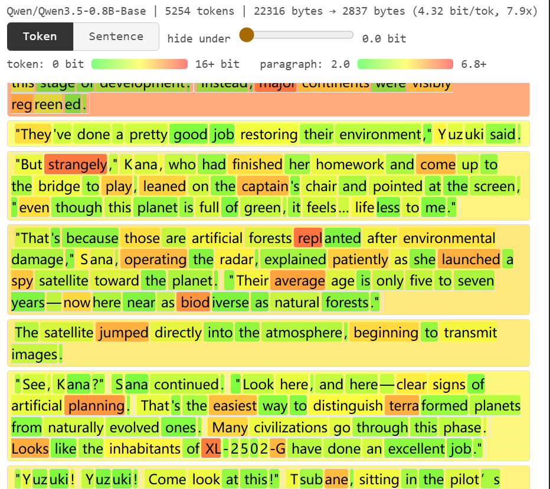

[中文](README.md) | [English](README.en.md)

# AI Writing Cliché Detector

> Your novel is so cliché, it reads like an AI wrote it

> Did AI ghostwrite your paper?

AI Writing Cliché Detector: from the AI's perspective, how cliché is your writing?

**Usage**

`python cliche_detector.py your_masterpiece.txt`

Open the generated `your_masterpiece.html` in the same directory.



**How to read the report**

There are two display modes — token and sentence — showing how "surprised" the AI is by each token, or by the sentence average.

— it's just perplexity, really~

* The greener it is, the more your writing resembles AI.

* The redder it is, the more "you" that word is — though it could also just be a typo.

**What can you do with it**

* **Highlight the good stuff** Keywords in a paper, plot twists in a novel — these are the things a small AI model can't predict. Helps you speed-read through a long, tedious article.
* **Self-reflection** The words that truly carry your writing style, your ideas — AI will highlight them in red. The ones you thought were clever but are actually cliché? Those turn bright green.
* **Study writing style** See which word choices, plot devices of an author are unique beyond the "human average."
* **AI-detection check** Paper got flagged as AI-generated? Use this to see which sentences taste the most like AI.
* **Riddle mode** Drag the `hide under` slider to hide the tokens/sentences that AI can effortlessly fill in. Can you reconstruct the entire plot from just the remaining red words?

**Setup**

Windows users: get into WSL first — PyTorch and HuggingFace are way less painful on Linux. Create a venv to keep dependencies isolated, so you don't mess up your system environment:

```bash
python3 -m venv ~/venvs/cliche
~/venvs/cliche/bin/pip install -r requirements.txt
source ~/venvs/cliche/bin/activate
python cliche_detector.py your_masterpiece.txt
```

`pip install torch` ships with CUDA support by default now; if you have a GPU it'll just use it. First run downloads the model from HuggingFace (~1.6GB), after that it works offline too.

**Arguments**

```
python cliche_detector.py input.txt [options]
```

| Argument | Description |
|----------|-------------|
| `-o report.html` | Output file path (default: `input.html`) |
| `--model Qwen/Qwen3.5-2B-Base` | Use a different model (this is the default) |
| `--top-k 20` | How many candidates to show in the tooltip (default: 10) |
| `--chunk-size 512` | Tokens per forward pass — turn it down if you're running low on VRAM (default: 4096) |
