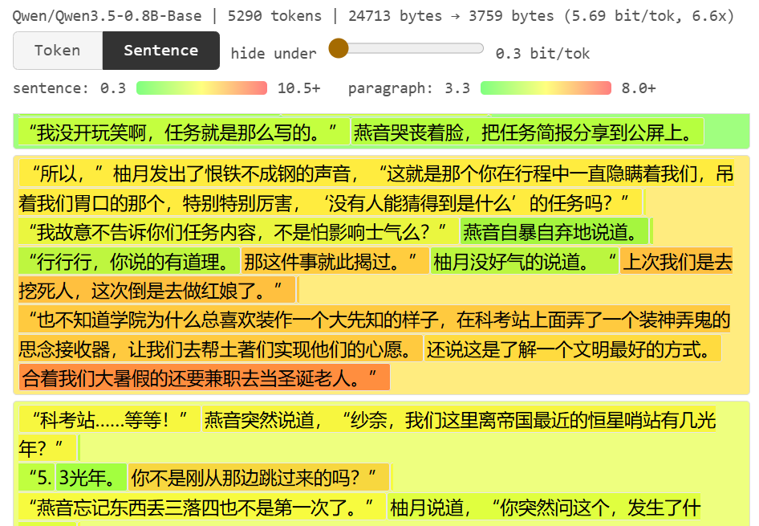

# AI写作查重器

> 你的小说太俗套了，像是 AI 编的故事

> 你的论文是 AI 帮你代写的么？

AI写作查重器：从 AI 的视角，你的文章有多俗套？

**用法**

`python cliche_detector.py 你的大作.txt`

打开同一目录下生成的`你的大作.html`。



**怎么读懂生成的报告**

有词元和句子两个显示模式，分别显示了每个词元以及句子平均，带给 AI 的“惊讶感”有多强。

——其实就是perplexity啦~

* 越绿，说明你写的越像AI。

* 越红，说明这个词很有“你”的特色——当然，也有可能只是错别字。

**可以用来干什么**

* **划重点** 论文的关键字，小说的神转折，都是对 小模型AI 来说很难预测的东西。可以帮你快速看完一篇又臭又长的长文章。
* **反省会** 那些真正有你的写作风格、你的想法的文字，AI 会帮你标红。而那些你自认为很聪明，但是其实很俗套的文字，会变得绿油油的。
* **学文风** 看看这个作者的用词，剧情设计，有哪些是独特于“人类平均值”的。
* **论文查重** 论文被系统标为 AI 生成怎么办？可以用这个工具看一下哪些句子更有 AI 味。
* **谜语人** 拉动`hide under`的进度条，把 AI 可以轻轻松松脑补的句子/词元给藏起来。你能根据剩下来的红色词语脑补出整个故事的情节么？

**怎么配置环境**

Windows 用户先进 WSL——PyTorch 和 HuggingFace 在 Linux 下最省心。建个 venv 把依赖隔离开，免得污染系统环境：

```bash
python3 -m venv ~/venvs/cliche
~/venvs/cliche/bin/pip install -r requirements.txt
source ~/venvs/cliche/bin/activate
python cliche_detector.py 你的大作.txt
```

`pip install torch` 现在默认就带 CUDA 支持，有 GPU 会自动用。第一次跑会从 HuggingFace 下载模型（~1.6GB），之后离线也能用。

**参数说明**

```
python cliche_detector.py input.txt [选项]
```

| 参数 | 说明 |
|------|------|
| `-o report.html` | 输出文件路径（默认：`input.html`） |
| `--model Qwen/Qwen3.5-2B-Base` | 换个模型（默认就是这个） |
| `--top-k 20` | tooltip 里显示多少个候选词（默认 10） |
| `--chunk-size 512` | 每次喂给模型多少 token，显存不够就调小（默认 4096） |
